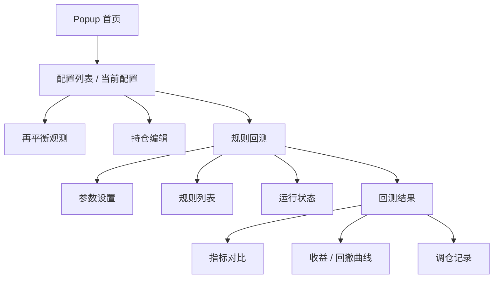
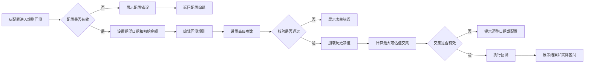

# 再平衡规则回测 UE/UI 设计图

本文用于补充 `再平衡规则回测` 的交互与界面设计，供产品、设计和开发评审使用。

对应文档：

- [再平衡规则回测需求文档](../需求文档/再平衡规则回测需求文档.md)
- [再平衡规则回测开发设计文档](./再平衡规则回测开发设计文档.md)

## 1. 设计目标

1. 在 Chrome Popup 内完成规则回测，不跳转外部页面。
2. 保持现有再平衡观测的轻量、信息密度和工具属性。
3. 让用户按“选配置 - 设区间 - 配规则 - 看结果”的路径完成回测。
4. 结果优先展示可比较指标，再展示曲线和调仓明细。
5. 规则回测作为具体配置的子功能，不作为 Popup 一级入口。
6. 实际回测区间采用所有基金可估值数据的最大交集。
7. 所有异常必须可理解、可修正、可重试。

## 2. 信息架构



入口放在配置内，不使用 `再平衡观测 / 规则回测` 的一级 segmented control。

```text
┌──────────────────────────────────────────┐
│ 当前配置：稳健组合                         │
│ [刷新观测] [编辑配置] [规则回测]             │
└──────────────────────────────────────────┘
```

## 3. 用户流程



## 4. 页面总览线框图

### 4.1 配置内入口状态

```text
┌──────────────────────────────────────────┐
│ Rebalancer                         ︙    │
├──────────────────────────────────────────┤
│ 稳健组合                                  │
│ 当前偏离 3.2%            [规则回测] [编辑] │
│                                          │
│ 再平衡观测                                │
│ ┌──────────────────────────────────────┐ │
│ │ 组合总市值 103,200   建议关注 2 项     │ │
│ └──────────────────────────────────────┘ │
│                                          │
│ ┌──────────────────────────────────────┐ │
│ │              进入规则回测             │ │
│ └──────────────────────────────────────┘ │
└──────────────────────────────────────────┘
```

### 4.2 参数设置状态

```text
┌──────────────────────────────────────────┐
│ 规则回测                                  │
│ 稳健组合                                  │
│ 对比该配置在不同再平衡规则下的历史表现。    │
│                                          │
│ 期望回测区间                              │
│ ┌──────────────┐ ┌──────────────┐        │
│ │ 2023-01-01   │ │ 2025-12-31   │        │
│ └──────────────┘ └──────────────┘        │
│                                          │
│ 初始金额                                  │
│ ┌──────────────────────────────────────┐ │
│ │ 100000                               │ │
│ └──────────────────────────────────────┘ │
│                                          │
│ 高级参数                                  │
│ ┌──────────────────────────────────────┐ │
│ │ 无风险收益率  2.00%                   │ │
│ └──────────────────────────────────────┘ │
│                                          │
│ 规则                                     │
│ ┌──────────────────────────────────────┐ │
│ │ 不再平衡                         ⋯   │ │
│ └──────────────────────────────────────┘ │
│ ┌──────────────────────────────────────┐ │
│ │ 月度再平衡                       ⋯   │ │
│ └──────────────────────────────────────┘ │
│ ┌──────────────────────────────────────┐ │
│ │ 偏离 5pp 触发                   ⋯   │ │
│ └──────────────────────────────────────┘ │
│                                          │
│ [+] 添加规则                             │
│                                          │
│ ┌──────────────────────────────────────┐ │
│ │              运行回测                 │ │
│ └──────────────────────────────────────┘ │
└──────────────────────────────────────────┘
```

### 4.3 运行中状态

```text
┌──────────────────────────────────────────┐
│ 规则回测                                  │
├──────────────────────────────────────────┤
│ 正在加载历史净值                          │
│ ┌──────────────────────────────────────┐ │
│ │ 000001  已完成                        │ │
│ │ 110011  加载中                        │ │
│ │ 161725  等待中                        │ │
│ └──────────────────────────────────────┘ │
│                                          │
│ 正在计算最大可回测区间                    │
│                                          │
│ ┌──────────────────────────────────────┐ │
│ │              加载中...                │ │
│ └──────────────────────────────────────┘ │
└──────────────────────────────────────────┘
```

### 4.4 结果状态

```text
┌──────────────────────────────────────────┐
│ 规则回测                                  │
│ 稳健组合                                  │
│ 期望区间 2023-01-01 至 2025-12-31         │
│ 实际区间 2023-02-10 至 2025-12-30         │
│ 无风险收益率 2.00%                         │
│ 回测仅代表历史模拟，不代表未来表现。        │
├──────────────────────────────────────────┤
│ ┌────────┬────────┬────────┐             │
│ │ 指标    │ 曲线    │ 调仓    │             │
│ └────────┴────────┴────────┘             │
│                                          │
│ 规则对比                                  │
│ ┌──────────────────────────────────────┐ │
│ │ 不再平衡       126,300   +26.30%     │ │
│ │ 月度再平衡     128,120   +28.12%     │ │
│ │ 偏离5pp        127,450   +27.45%     │ │
│ └──────────────────────────────────────┘ │
│                                          │
│ 关键指标                                  │
│ ┌────────┬────────┬────────┬────────┐    │
│ │ 回撤    │ 波动    │ 夏普    │ 卡玛    │    │
│ │ -12.4% │ 16.8%  │ 0.72   │ 0.66   │    │
│ └────────┴────────┴────────┴────────┘    │
│                                          │
│ ┌──────────────────────────────────────┐ │
│ │              重新运行                 │ │
│ └──────────────────────────────────────┘ │
└──────────────────────────────────────────┘
```

## 5. 关键区域设计

### 5.1 参数设置区

字段：

1. 当前配置摘要：只读，展示配置名称、持仓数和目标比例校验状态。
2. 期望开始日期：日期输入。
3. 期望结束日期：日期输入。
4. 初始金额：数字输入，默认配置总金额。
5. 高级参数：无风险收益率，默认 `2.00%`。
6. 强制刷新：开关，默认关闭。

实际回测区间：

1. 用户不手动输入实际区间。
2. 系统在加载历史净值后自动计算最大可估值交集。
3. 结果页必须展示实际区间。
4. 若实际区间不足 2 个共同可估值日，禁止运行并展示错误。

校验展示：

```text
┌──────────────────────────────────────┐
│ 2025-01-01                            │
└──────────────────────────────────────┘
开始日期必须早于结束日期
```

### 5.2 规则卡片

```text
┌──────────────────────────────────────────┐
│ 月度再平衡                         [⋯]   │
│ 类型  ┌──────────────────────────────┐   │
│       │ 固定频率再平衡            ▾   │   │
│ 频率  ┌──────────────┐                 │
│       │ 每月      ▾  │                 │
└──────────────────────────────────────────┘
```

阈值规则：

```text
┌──────────────────────────────────────────┐
│ 偏离 5pp 触发                      [⋯]   │
│ 类型  ┌──────────────────────────────┐   │
│       │ 阈值触发再平衡            ▾   │   │
│ 阈值  ┌──────────────┐ ┌──────────┐   │
│       │ 5            │ │ pp 偏离 ▾ │   │
└──────────────────────────────────────────┘
```

固定频率 + 阈值规则：

```text
┌──────────────────────────────────────────┐
│ 季度检查 + 5pp                     [⋯]   │
│ 类型  ┌──────────────────────────────┐   │
│       │ 固定频率检查 + 阈值触发    ▾   │   │
│ 频率  ┌──────────────┐                 │
│       │ 每季度    ▾  │                 │
│ 阈值  ┌──────────────┐ ┌──────────┐   │
│       │ 5            │ │ pp 偏离 ▾ │   │
└──────────────────────────────────────────┘
```

规则卡片操作：

1. 更多菜单：重命名、复制、删除。
2. 删除后至少保留 1 条规则。
3. 规则最多 6 条。
4. 新增规则默认命名为 `新规则 N`。

## 6. 结果页设计

### 6.1 指标 Tab

```text
┌──────────────────────────────────────────┐
│ 指标对比                                  │
├──────────────────────────────────────────┤
│ 核心指标                                  │
│ 规则        期末金额    年化收益   最大回撤 │
│ 不再平衡    126,300    +8.20%    -12.40% │
│ 月度再平衡  128,120    +8.75%    -11.90% │
│ 偏离5pp     127,450    +8.55%    -12.10% │
├──────────────────────────────────────────┤
│ 风险调整                                  │
│ 规则        波动率      夏普       卡玛     │
│ 不再平衡    16.80%    0.37      0.66     │
│ 月度再平衡  16.20%    0.42      0.74     │
│ 偏离5pp     16.50%    0.40      0.71     │
├──────────────────────────────────────────┤
│ 调仓统计                                  │
│ 规则        次数       总金额      年化换手 │
│ 不再平衡    0         0          0.00%    │
│ 月度再平衡  34        82,400     27.10%   │
│ 偏离5pp     9         31,800     10.50%   │
└──────────────────────────────────────────┘
```

设计要求：

1. 规则名称固定在左侧，指标横向紧凑展示。
2. 收益为正使用强调色，收益为负使用风险色。
3. 最大回撤始终显示负数。
4. 同一规则在指标、曲线、调仓记录中使用同一颜色标识。
5. 核心指标默认展示，扩展指标通过展开区展示。
6. 夏普比率使用高级参数中的无风险收益率计算。

扩展指标：

1. 累计收益率。
2. 日胜率。
3. 最佳单日收益。
4. 最差单日收益。
5. 最大连续回撤天数。
6. 收益回撤比。
7. 平均单次调仓金额。

### 6.2 曲线 Tab

```text
┌──────────────────────────────────────────┐
│ [收益曲线] [回撤曲线]                     │
│                                          │
│ 1.30 ┤                         ╭──       │
│ 1.20 ┤              ╭────╮  ╭──╯         │
│ 1.10 ┤      ╭───────╯    ╰──╯            │
│ 1.00 ┼──────╯                            │
│      2023        2024        2025        │
│                                          │
│ ● 不再平衡  ● 月度再平衡  ● 偏离5pp       │
└──────────────────────────────────────────┘
```

交互：

1. 悬停显示日期、规则名称和数值。
2. 点击图例可临时隐藏或显示某条规则。
3. 曲线为空时展示可读错误，不显示空白图。

### 6.3 调仓 Tab

```text
┌──────────────────────────────────────────┐
│ 规则  ┌──────────────────────────────┐   │
│       │ 月度再平衡                ▾   │   │
├──────────────────────────────────────────┤
│ 2024-03-29  月度检查                      │
│ 调仓前市值 112,430    换手 4,280          │
│ ┌──────────────────────────────────────┐ │
│ │ 000001  卖出 2,100                   │ │
│ │ 110011  买入 1,680                   │ │
│ │ 161725  买入   420                   │ │
│ └──────────────────────────────────────┘ │
│                                          │
│ 2024-04-30  月度检查                      │
│ 调仓前市值 113,020    换手 1,950          │
└──────────────────────────────────────────┘
```

空状态：

```text
┌──────────────────────────────────────────┐
│ 该规则在回测区间内没有触发再平衡。          │
└──────────────────────────────────────────┘
```

## 7. 异常状态设计

### 7.1 无可用配置

```text
┌──────────────────────────────────────────┐
│ 还没有可用于回测的配置。                   │
│ 请先创建至少包含 1 个基金持仓的配置。       │
│ ┌──────────────────────────────────────┐ │
│ │          去创建配置                   │ │
│ └──────────────────────────────────────┘ │
└──────────────────────────────────────────┘
```

### 7.2 历史数据缺失

```text
┌──────────────────────────────────────────┐
│ 无法运行回测                              │
│ 所选基金在期望区间内没有共同可回测区间。    │
│ 请调整日期范围或移除数据不足的基金后重试。  │
│ ┌────────────────────┐ ┌──────────────┐  │
│ │ 修改日期            │ │ 重试          │  │
│ └────────────────────┘ └──────────────┘  │
└──────────────────────────────────────────┘
```

### 7.3 规则配置不完整

```text
┌──────────────────────────────────────────┐
│ 偏离触发规则缺少阈值。                     │
│ 请设置大于 0 的阈值后再运行。               │
└──────────────────────────────────────────┘
```

## 8. 视觉规范

### 8.1 布局

1. Popup 宽度按现有产品容器适配，不新增外部页面。
2. 内容采用单列纵向布局。
3. 参数区、规则区、结果区之间使用 16px 间距。
4. 表单控件高度保持一致，避免输入区跳动。
5. 结果 tab 固定在结果区顶部。

### 8.2 颜色

颜色延续现有 UI，不引入新的主色体系。

建议语义：

1. 正收益：沿用成功/正向色。
2. 负收益和错误：沿用风险色。
3. 中性指标：沿用正文和次级文本色。
4. 曲线颜色：最多 6 个可区分颜色，避免只用同一色相深浅变化。

### 8.3 图标

使用现有图标库风格：

1. 添加规则：`Plus`
2. 删除规则：`Trash2`
3. 复制规则：`Copy`
4. 运行回测：`Play`
5. 重试：`RefreshCw`
6. 更多操作：`MoreHorizontal`
7. 提示信息：`Info`

## 9. 组件清单

建议新增组件：

1. `BacktestPanel`
2. `BacktestConfigForm`
3. `BacktestRuleList`
4. `BacktestRuleCard`
5. `BacktestRunButton`
6. `BacktestResultView`
7. `BacktestMetricTable`
8. `BacktestLineChart`
9. `BacktestDrawdownChart`
10. `BacktestRebalanceRecords`
11. `BacktestErrorState`
12. `BacktestEmptyState`

## 10. 评审关注点

1. 规则回测入口是否固定放在配置内。
2. 默认 3 条规则是否符合用户预期。
3. 指标、曲线、调仓是否拆成 3 个 tab。
4. 调仓记录是否需要默认展开第一条。
5. Popup 内是否接受最多 6 条规则的展示密度。
6. 曲线交互是否必须支持悬停 tooltip 和图例开关。
7. 实际回测区间是否采用最大可估值交集并在结果页展示。
8. 无风险收益率是否默认 `2.00%`，并放在高级参数中。
