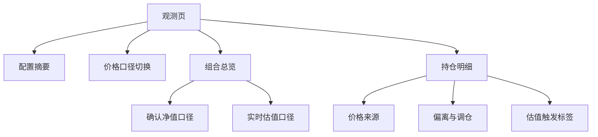

# 实时估值再平衡观测 PRD

## 1. 文档目标

定义 Rebalancer 在现有“确认净值再平衡观测”基础上，引入实时估值口径后的产品需求、计算规则、异常边界和 UI 方案。

该功能用于让用户在盘中或当日净值发布前，提前观察组合是否可能触发再平衡信号。

---

## 2. 背景与问题

当前再平衡观测全部基于最新确认单位净值。该口径稳定、可复盘，但存在一个明显滞后：

1. 基金确认净值通常在交易日收盘后更新。
2. 用户在交易时段或收盘后净值未更新前，无法提前看到组合偏离变化。
3. 对临近阈值的组合，用户只能等确认净值更新后再判断，操作前瞻性不足。

因此需要增加“实时估值模式”，让用户可以基于基金估算净值观察组合偏离与调仓信号。

---

## 3. 产品定位

### 3.1 功能定位

实时估值模式是现有再平衡观测的辅助口径，不替代确认净值口径。

确认净值模式回答：

1. 基于最新确认净值，组合当前偏离多少。
2. 基于事实净值，是否已经达到再平衡阈值。
3. 基于确认净值，建议买入或卖出多少。

实时估值模式回答：

1. 基于盘中或收盘估值，组合可能偏离多少。
2. 当日估值变化是否已经触发再平衡观察信号。
3. 哪些持仓的触发状态与确认净值口径不同。

### 3.2 产品边界

1. 不提供交易执行。
2. 不预测最终确认净值。
3. 不承诺估值与最终净值一致。
4. 不做分钟估值曲线。
5. 不做行情面板。
6. 不做多估值数据源兜底。
7. 不改变历史回测的确认净值口径。

---

## 4. 用户场景

1. 用户在交易日盘中打开插件，希望提前观察组合是否接近再平衡阈值。
2. 用户在收盘后、当日确认净值尚未发布前，希望用收盘估值进行预判。
3. 用户看到估值模式触发再平衡，希望知道这是否只是估值导致的临时信号。
4. 用户希望在当日真实净值已经更新后，估值模式自动使用当日真实净值，避免继续使用旧估值。
5. 用户持仓中包含 QDII、新发基金或暂无估值基金，希望页面能降级展示，不影响其他持仓观察。

---

## 5. 功能范围

### 5.1 必须交付

1. 观测页增加价格口径切换：
   - 确认净值
   - 实时估值
2. 实时估值模式下，使用估算净值参与组合市值、当前占比、偏离和调仓金额计算。
3. 当日真实净值已更新时，实时估值模式自动使用当日真实净值替代估值。
4. 单只基金估值缺失时，允许回退到确认净值。
5. 展示每只基金当前价格来源。
6. 展示实时估值口径相对确认净值口径的组合级差异。
7. 标记“确认净值未触发，但估值触发”的持仓或组合信号。
8. 保持单只基金请求失败不影响其他基金展示。

### 5.2 不在本期范围

1. 分钟级估值曲线。
2. 自动交易日历和完整节假日维护。
3. 自动刷新定时器。
4. 多估值 provider。
5. 估值准确性统计。
6. 推送提醒。
7. 交易下单。

---

## 6. 数据源需求

### 6.1 批量基金估值接口

使用东方财富批量估值接口。

```text
GET https://fundmobapi.eastmoney.com/FundMNewApi/FundMNFInfo
```

请求参数：

| 参数 | 示例 | 说明 |
| --- | --- | --- |
| `pageIndex` | `1` | 固定值 |
| `pageSize` | `200` | 单次最大数量 |
| `plat` | `Android` | 固定值 |
| `appType` | `ttjj` | 固定值 |
| `product` | `EFund` | 固定值 |
| `Version` | `1` | 固定值，注意大写 |
| `deviceid` | UUID | 本地生成并持久化 |
| `Fcodes` | `001618,161725` | 逗号分隔基金代码 |

### 6.2 字段映射

| 接口字段 | 本地字段 | 含义 |
| --- | --- | --- |
| `FCODE` | `code` | 基金代码 |
| `SHORTNAME` | `name` | 基金简称 |
| `PDATE` | `confirmedDate` | 确认净值日期 |
| `NAV` | `confirmedNav` | 确认单位净值 |
| `GSZ` | `estimatedNav` | 估算单位净值 |
| `GSZZL` | `estimatedChangeRate` | 估算涨跌幅 |
| `GZTIME` | `estimatedAt` | 估值更新时间 |
| `NAVCHGRT` | `actualChangeRate` | 确认净值日涨跌幅 |

### 6.3 标准化规则

1. `NAV` 非数字时记为 `null`。
2. `GSZ` 非数字时记为 `null`。
3. `GSZZL` 非数字时记为 `0`。
4. `NAVCHGRT` 非数字时记为 `0`。
5. `PDATE` 为 `--` 时视为无确认净值日期。
6. `GZTIME` 为空时视为无估值更新时间。

### 6.4 当日真实净值替代估值

当满足以下条件时，说明当日真实净值已经更新：

```text
PDATE != "--" 且 GZTIME 存在 且 PDATE == GZTIME 的日期部分
```

此时实时估值模式不再使用 `GSZ`，而是使用：

1. 当前价格：`NAV`
2. 当日涨跌幅：`NAVCHGRT`
3. 价格来源：`actual-today`

---

## 7. 核心概念

### 7.1 价格模式

```ts
type ObservationPriceMode = "confirmed" | "estimated";
```

| 模式 | 说明 |
| --- | --- |
| `confirmed` | 使用最新确认单位净值 |
| `estimated` | 优先使用实时估值，必要时降级 |

### 7.2 价格来源

```ts
type QuotePriceSource =
  | "estimated"
  | "actual-today"
  | "confirmed"
  | "unavailable";
```

| 来源 | 说明 |
| --- | --- |
| `estimated` | 使用接口返回的估算净值 `GSZ` |
| `actual-today` | 当日真实净值已更新，使用 `NAV` 替代估值 |
| `confirmed` | 估值不可用，回退到最新确认净值 |
| `unavailable` | 无任何可用价格 |

### 7.3 基金报价结构

```ts
interface FundQuote {
  code: string;
  name: string;
  confirmedNav: number | null;
  confirmedDate: string;
  estimatedNav: number | null;
  estimatedChangeRate: number;
  estimatedAt: string;
  actualChangeRate: number;
  hasActualNavToday: boolean;
  fetchedAt: number;
}
```

### 7.4 有效价格结构

```ts
interface EffectivePrice {
  nav: number;
  source: QuotePriceSource;
  dateLabel: string;
  changeRate?: number;
}
```

---

## 8. 计算口径

### 8.1 初始份额

初始份额始终使用起始日确认净值。

```text
初始分配金额 = 配置总金额 × 目标比例
初始份额 = 初始分配金额 / 起始日确认净值
```

### 8.2 确认净值模式

```text
当前市值 = 初始份额 × 最新确认净值
当前占比 = 当前市值 / 组合总市值
偏离 = 当前占比 - 目标占比
建议调仓金额 = 目标市值 - 当前市值
```

### 8.3 实时估值模式

有效价格选择顺序：

```text
如果当日真实净值已更新：使用 NAV
否则如果 GSZ 可用：使用 GSZ
否则如果 NAV 可用：使用 NAV
否则该基金价格不可用
```

计算公式与确认净值模式一致，但文案使用“估算”口径：

```text
估算市值 = 初始份额 × 有效价格
估算占比 = 估算市值 / 组合估算总市值
估算调仓金额 = 目标市值 - 估算市值
```

### 8.4 组合级差异

实时估值模式下，需要同时计算一份确认净值口径结果，用于比较。

```text
组合市值差异 = 实时估值口径总市值 - 确认净值口径总市值
组合偏离差异 = 实时估值口径组合偏离 - 确认净值口径组合偏离
```

持仓级差异：

```text
价格差异 = 有效价格 - 确认净值
价格差异率 = 价格差异 / 确认净值
偏离差异 = 估值口径偏离 - 确认净值口径偏离
```

### 8.5 触发来源

实时估值模式下，比较确认净值口径和估值口径的再平衡状态。

| 确认净值口径 | 实时估值口径 | 展示标签 |
| --- | --- | --- |
| 未触发 | 触发 | `估值触发` |
| 触发 | 触发 | `需再平衡` |
| 触发 | 未触发 | `估值回落` |
| 未触发 | 未触发 | 不展示额外标签 |

---

## 9. 时段与降级规则

### 9.1 基础判断

第一版只做轻量判断：

1. 周六、周日视为非交易日。
2. 周一至周五按北京时间判断交易时段。
3. 是否已有当日真实净值，不靠时间推断，只靠 `PDATE == GZTIME 日期部分` 判断。
4. 法定节假日暂不维护完整交易日历。

### 9.2 时段规则

| 场景 | 实时估值模式行为 | UI 提示 |
| --- | --- | --- |
| 交易日 09:30-11:35 | 优先使用 `GSZ` | `盘中估值` |
| 交易日 11:35-13:00 | 使用最近一次 `GSZ` | `午间估值` |
| 交易日 13:00-15:05 | 优先使用 `GSZ` | `盘中估值` |
| 交易日 15:05 后，当日净值未更新 | 使用收盘附近最后估值 | `收盘估值，待净值更新` |
| 交易日 15:05 后，当日净值已更新 | 使用 `NAV` 替代估值 | `当日净值已更新` |
| 周末 | 回退确认净值，除非估值接口返回有效当日替代结果 | `非交易日，使用确认净值` |
| 估值缺失 | 单只基金回退确认净值 | `暂无估值` |
| 确认净值也缺失 | 单只基金置为错误 | `价格不可用` |

### 9.3 刷新规则

1. 手动刷新时，同时刷新基金报价、起始历史净值和基准数据。
2. 第一版不做自动定时刷新。
3. 估值报价缓存建议 60 秒。
4. 历史净值缓存可长期保留。
5. 强制刷新必须绕过估值报价缓存。

---

## 10. UI 设计

### 10.1 信息架构



### 10.2 观测页总览

```text
┌──────────────────────────────────────────┐
│ 稳健组合                           刷新  │
│ ┌──────────────┬──────────────┐          │
│ │ 确认净值      │ 实时估值      │          │
│ └──────────────┴──────────────┘          │
│                                          │
│ 组合估算总市值                            │
│ 103,482.20                               │
│ 较确认净值口径 +482.20，偏离变化 +0.32pp   │
│                                          │
│ 状态：估值触发 2 项                       │
│ 估值时间：2026-04-27 14:35               │
└──────────────────────────────────────────┘
```

确认净值模式下：

```text
┌──────────────────────────────────────────┐
│ 组合总市值                                │
│ 103,000.00                               │
│ 最新净值日期：2026-04-26                  │
│ 状态：观察中                              │
└──────────────────────────────────────────┘
```

### 10.3 持仓明细

实时估值模式下，每只基金展示：

```text
┌──────────────────────────────────────────┐
│ 易方达蓝筹精选                 估值触发   │
│ 目标 30.00%     当前 35.40%     +5.40pp   │
│ 估算卖出 5,230.00                         │
│ 估值 1.9823   较净值 +1.12%               │
│ 盘中估值 2026-04-27 14:35                 │
└──────────────────────────────────────────┘
```

估值缺失并回退确认净值时：

```text
┌──────────────────────────────────────────┐
│ 某 QDII 基金                    暂无估值  │
│ 目标 10.00%     当前 9.80%      -0.20pp   │
│ 估算买入 210.00                           │
│ 使用确认净值 1.1234，日期 2026-04-26       │
└──────────────────────────────────────────┘
```

当日真实净值已更新时：

```text
┌──────────────────────────────────────────┐
│ 沪深300ETF联接                 当日净值   │
│ 目标 20.00%     当前 19.60%     -0.40pp   │
│ 估算买入 420.00                           │
│ 已使用当日确认净值 1.4567                  │
└──────────────────────────────────────────┘
```

### 10.4 标签文案

| 状态 | 标签 | 说明 |
| --- | --- | --- |
| 使用估值 | `估值` | 使用 `GSZ` |
| 当日真实净值替代 | `当日净值` | 使用当日 `NAV` |
| 回退确认净值 | `净值` | 估值缺失或非交易日 |
| 无估值 | `暂无估值` | 单只基金估值不可用 |
| 估值新增触发 | `估值触发` | 确认净值未触发，估值触发 |
| 估值取消触发 | `估值回落` | 确认净值触发，估值未触发 |

### 10.5 交互规则

1. 默认进入确认净值模式。
2. 用户切换实时估值模式后，仅影响当前观测页展示。
3. 价格口径切换状态可本地保存，便于下次打开延续。
4. 切换模式时，不修改配置。
5. 切换模式时，若估值报价缓存有效，立即重算；否则拉取估值。
6. 刷新按钮在两种模式下都可用。
7. 实时估值模式下，刷新成功后更新估值时间。
8. 部分基金降级时，组合总览显示降级数量：

```text
8/10 只使用实时估值，2 只沿用确认净值
```

### 10.6 视觉原则

1. 不新增大面积行情图。
2. 不用高饱和色突出估值涨跌。
3. `估值触发` 可以使用警示色，但强度低于真正的错误状态。
4. `暂无估值`、`净值` 使用中性色。
5. 总览优先展示再平衡结论，而不是价格变化。
6. diff 文案只展示一行，避免页面噪音。

---

## 11. 异常与提示

| 异常 | 处理 | 提示 |
| --- | --- | --- |
| 批量估值接口失败 | 回退现有确认净值口径 | `估值获取失败，已使用确认净值` |
| 单只基金缺少 `GSZ` | 使用 `NAV` | `暂无估值` |
| 单只基金 `NAV` 和 `GSZ` 都不可用 | 单只基金错误 | `价格不可用` |
| `GZTIME` 为空 | 不展示估值时间 | `估值时间未知` |
| 当日真实净值已更新 | 使用 `NAV` | `当日净值已更新` |
| 非交易日打开估值模式 | 使用确认净值 | `非交易日，使用确认净值` |

---

## 12. 数据与存储

### 12.1 新增缓存

```ts
interface AppState {
  fundQuoteCache?: Record<string, FundQuote>;
  observationPriceMode?: ObservationPriceMode;
  valuationDeviceId?: string;
}
```

### 12.2 缓存规则

1. `fundQuoteCache` 按基金代码存储。
2. 估值报价缓存 TTL 为 60 秒。
3. `valuationDeviceId` 首次生成后持久化。
4. 历史净值缓存沿用现有结构。
5. 旧 `fundCache` 可保留作为兼容字段，后续再迁移。

---

## 13. 验收标准

1. 观测页可在确认净值和实时估值之间切换。
2. 默认模式为确认净值。
3. 实时估值模式下，基金市值、占比、偏离、调仓金额使用有效估值价格计算。
4. 当 `PDATE == GZTIME` 日期部分时，实时估值模式使用 `NAV` 替代 `GSZ`。
5. 单只基金估值缺失时，该基金回退确认净值，其他基金不受影响。
6. 估值接口整体失败时，页面可回退确认净值口径并给出提示。
7. 实时估值模式下展示每只基金价格来源。
8. 实时估值模式下展示相对确认净值口径的组合级差异。
9. 确认净值未触发但估值触发时，页面显示 `估值触发`。
10. 周末打开实时估值模式时，不展示误导性的盘中估值状态。
11. 切换价格口径不修改用户配置。
12. 历史回测仍使用确认净值，不受实时估值模式影响。

---

## 14. 后续可选演进

1. 引入完整交易日历，准确识别法定节假日。
2. 增加交易时段内自动刷新。
3. 增加单只基金分钟估值曲线。
4. 增加估值命中率和降级统计。
5. 增加估值触发提醒。
6. 增加多估值数据源兜底。
